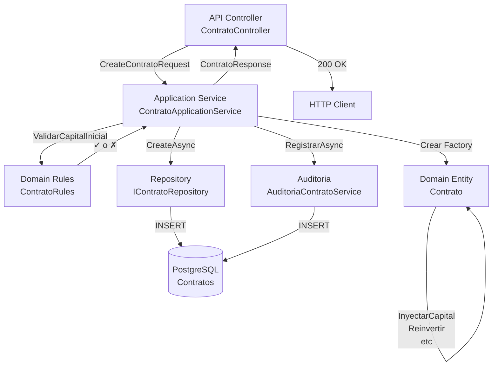

# MÓDULO COMPLETO DE CONTRATOS - Documentación

## 📋 Resumen Ejecutivo

Este módulo implementa la **gestión completa del ciclo de vida de contratos** en un sistema financiero, utilizando **Clean Architecture** y **DDD (Domain-Driven Design)**.

### Características Principales:
✅ Creación de contratos con validaciones de dominio  
✅ Contratos adicionales para un cliente  
✅ Unificación de múltiples contratos  
✅ Inyección de capital (crear nuevo contrato + cerrar actual)  
✅ Reinversión de ganancias  
✅ Gestión de beneficiarios por contrato  
✅ Auditoría completa de cada operación  
✅ Value Objects para Capital y Porcentaje  
✅ Reglas de negocio centralizadas (carpeta Rules)  
✅ Configuración Fluent API con CHECK constraints  

---

## 🏗️ Arquitectura de Capas

### 1. Domain Layer
**Ubicación:** `Tracor.Domain/Models/`

#### Enums
```csharp
// EstadoContrato.cs
EstadoContrato: Activo, Finalizado, Unificado, Anulado
TipoOperacion: Creacion, Actualizacion, Reinversion, CambioPorcentaje, InyeccionCapital, Unificacion, Desunificacion, Finalizacion, CambioEstado, CambioBeneficiarios, CambioCapital
ModalidadRendimiento: Normal, InteresCompuesto
TipoRelacionContrato: Unificacion, Desunificacion, InyeccionCapital, Reinversion
```

#### Value Objects
```csharp
// Capital.cs - Garantiza valores siempre válidos
Capital(valor)
  - Validar que no sea negativo
  - Sumar(), Restar(), Multiplicar()
  - Soporte para operadores de comparación

// Porcentaje.cs
Porcentaje(valor) // 0-100
  - Sumar() con validación
```

#### Entidades de Dominio
```csharp
// Contrato.cs
- Factory Method: Crear(clienteId, numero, fecha, capital, porcentaje, comision, modalidad, permiteUnificacion)
- Métodos de Dominio:
  * InyectarCapital(capital)
  * Reinvertir(ganancias, nuevoPorcentaje?)
  * CambiarPorcentajeMensual(nuevoPorc)
  * Finalizar()
  * MarcarComoUnificado()
  * ValidarEstaActivo()
- Todas las propiedades son privadas set, inmutables desde afuera

// ContratoBeneficiario.cs
- ContratoId, ClienteBeneficiarioId, PorcentajeAsignado

// AuditoriaContrato.cs
- Factory: Crear(contratoId, tipo, usuarioId, valorAnterior, valorNuevo, observacion)
- Almacena en JSONB para trazabilidad
```

#### Reglas de Negocio (Carpeta Rules)
```csharp
// ContratoRules.cs - Métodos estáticos puros
ContratoRules:
  - ValidarCapitalInicial(capital)
  - ValidarPorcentajeMensual(pct)
  - ValidarCantidadBeneficiarios(qty)
  - ValidarPorcentajesBeneficiarios(suma)
  - ValidarEstadoParaUnificacion(estado)
  - ValidarComisionRetiro(comision)

UnificacionRules:
  - ValidarCantidadContratosAUnificar(qty)
  - ValidarTodosActivosParaUnificacion(estados)
  - ValidarPermiteUnificacion(permite)

ReinversionRules:
  - ValidarPorcentajeReinversion(pct)
  - ValidarNuevoPorcentajeMensual(pct)

BeneficiarioRules:
  - ValidarPorcentajeAsignado(pct)
  - ValidarPorcentajeDisponible(nuevo, suma)
```

#### Excepciones de Dominio
```csharp
DomainException: Base
ReglaNegocioException: Reglas violadas
ContratoNoEncontradoException
OperacionNoPermitidaException
```

---

### 2. Application Layer
**Ubicación:** `Tracor.Application/`

#### DTOs
```csharp
CreateContratoRequest, CreateContratoAdicionalRequest
UnificarContratosRequest, InyectarCapitalRequest
ReinvertirGananciasRequest, CambiarPorcentajeRequest

ContratoResponse, OperacionContratoResponse
ContratoBeneficiarioResponse, AuditoriaContratoResponse
```

#### Interfaces de Repositorios
```csharp
IContratoRepository
  - GetByIdAsync, GetByNumeroAsync
  - GetActivosPorClienteAsync, GetPorClienteAsync
  - CreateAsync, UpdateAsync, DeleteAsync
  - GetProximoNumeroContratoAsync

IContratoRelacionRepository
  - CreateAsync, GetPorContratoAsync

IAuditoriaContratoRepository
  - CreateAsync, GetPorContratoAsync

IContratoBeneficiarioRepository
  - CreateAsync, GetPorContratoAsync
  - GetSumaPorcentajesAsync, DeleteAsync
```

#### Servicios de Aplicación
```csharp
IContratoApplicationService
  - CrearContratoAsync(request, usuarioId)
  - CrearContratoAdicionalAsync(request, usuarioId)
  - UnificarContratosAsync(request, usuarioId)
  - InyectarCapitalAsync(request, usuarioId)
  - ReinvertirGananciasAsync(request, usuarioId)
  - CambiarPorcentajeAsync(request, usuarioId)
  - ObtenerContratoAsync(id)
  - ObtenerContratosActivosAsync(clienteId)
  - ObtenerAuditoriaAsync(contratoId)

IAuditoriaContratoService
  - RegistrarAsync(contratoId, tipo, usuarioId, antes?, despues?, obs?)
```

---

### 3. Infrastructure Layer
**Ubicación:** `Tracor.Infrastructure/`

#### Configuración EF Core
```csharp
// ContratoConfigurations.cs
ContratoConfiguration:
  - HasConversion<string>() para enums
  - CHECK constraints en PostgreSQL
  - Índices para performance
  - Relaciones con eliminación en cascada controlada

ContratoBeneficiarioConfiguration:
  - Validar porcentajes 0-100

ContratoRelacionConfiguration:
  - Auditoría automática de relaciones

AuditoriaContratoConfiguration:
  - Columntype jsonb para valores
  - Índices en ContratoId para búsquedas
```

#### Repositorios
```csharp
// ContratoRepositories.cs
ContratoRepository: Implementa IContratoRepository
  - LINQ con AsNoTracking para lecturas
  - Include de navegaciones necesarias
  - SaveChangesAsync en cada mutación

ContratoRelacionRepository, AuditoriaContratoRepository
ContratoBeneficiarioRepository: Especializados
```

#### Servicio de Auditoría
```csharp
AuditoriaContratoService: IAuditoriaContratoService
  - Desacoplado como cross-cutting concern
  - Serializa objetos a JSON automáticamente
  - Registra usuario, fecha, tipo de operación
```

---

### 4. API Layer
**Ubicación:** `Tracor.API/Controllers/`

```csharp
ContratosController
  POST   /api/contratos                           -> CrearContrato
  POST   /api/contratos/adicional                 -> CrearContratoAdicional
  POST   /api/contratos/unificar                  -> UnificarContratos
  POST   /api/contratos/{id}/inyectar-capital     -> InyectarCapital
  POST   /api/contratos/{id}/reinvertir-ganancias -> ReinvertirGanancias
  PUT    /api/contratos/{id}/porcentaje           -> CambiarPorcentaje
  GET    /api/contratos/{id}                      -> ObtenerContrato
  GET    /api/contratos                           -> ObtenerContratos
  GET    /api/contratos/{id}/auditoria            -> ObtenerAuditoria
```

---

## 📖 Ejemplos Completos

### Ejemplo 1: Crear un Contrato

**Request:**
```json
POST /api/contratos

{
  "clienteId": 1,
  "numeroContrato": "CNT-001",
  "fechaInicio": "2026-05-07",
  "capitalInicial": 10000,
  "porcentajeMensual": 6.5,
  "comisionRetiro": 2,
  "modalidadRendimiento": "Normal",
  "permiteUnificacion": true
}
```

**Flujo de Ejecución:**
1. `ContratoApplicationService.CrearContratoAsync()`
2. Validar cliente existe `IClienteRepository.GetByIdAsync()`
3. Parsear enum `ModalidadRendimiento`
4. **Factory Method:** `Contrato.Crear()` con validaciones:
   - `ContratoRules.ValidarCapitalInicial(new Capital(10000))` ✓
   - `ContratoRules.ValidarPorcentajeMensual(6.5)` ✓
   - `ContratoRules.ValidarComisionRetiro(2)` ✓
5. `IContratoRepository.CreateAsync(contrato)` → INSERT en BD
6. Registrar auditoría:
   ```csharp
   await _auditoriaService.RegistrarAsync(
       1,              // contratoId
       "Creacion",     // TipoOperacion
       usuarioId,
       null,           // sin valor anterior
       new { NumeroContrato = "CNT-001", CapitalInicial = 10000 },
       "Creación de contrato nuevo"
   );
   ```
7. Mapear a `ContratoResponse` y retornar 201 Created

**Response:**
```json
{
  "id": 1,
  "clienteId": 1,
  "numeroContrato": "CNT-001",
  "fechaInicio": "2026-05-07",
  "capitalInicial": 10000,
  "capitalActual": 10000,
  "porcentajeMensual": 6.5,
  "comisionRetiro": 2,
  "modalidadRendimiento": "Normal",
  "estado": "Activo",
  "permiteUnificacion": true,
  "fechaCreacion": "2026-05-07T14:30:00Z",
  "fechaCierre": null
}
```

---

### Ejemplo 2: Unificar Contratos

**Request:**
```json
POST /api/contratos/unificar

{
  "clienteId": 1,
  "contratoIdsAUnificar": [2, 3, 4],
  "numeroContratoUnificado": "CNT-UNF-001",
  "fechaInicio": "2026-05-07",
  "porcentajeMensual": 7.0
}
```

**Flujo de Ejecución:**
1. `ContratoApplicationService.UnificarContratosAsync()`
2. `UnificacionRules.ValidarCantidadContratosAUnificar(3)` → ≥ 2 ✓
3. Obtener contratos: `IContratoRepository.GetByIdAsync(2)`, `.GetByIdAsync(3)`, `.GetByIdAsync(4)`
4. Validar estados:
   - `UnificacionRules.ValidarTodosActivosParaUnificacion([Activo, Activo, Activo])` ✓
   - `UnificacionRules.ValidarPermiteUnificacion(true)` para cada uno ✓
5. Calcular capital total: 10000 + 8000 + 5000 = 23000
6. **Factory:** `Contrato.Crear(..., 23000, 7.0)` con validaciones
7. Crear contrato unificado: `IContratoRepository.CreateAsync()`
8. Marcar antiguos como unificados:
   ```csharp
   foreach (var c in contratos)
   {
       c.MarcarComoUnificado();  // Estado = Unificado
       await _contratoRepository.UpdateAsync(c);
       
       // Crear relación
       var relacion = new ContratoRelacion
       {
           ContratoOrigenId = c.Id,
           ContratoDestinoId = contratoUnificado.Id,
           TipoRelacion = TipoRelacionContrato.Unificacion,
           MontoTransferido = c.CapitalActual,
           UsuarioId = usuarioId
       };
       await _relacionRepository.CreateAsync(relacion);
   }
   ```
9. Registrar auditoría x3:
   ```sql
   INSERT INTO "AuditoriaContratos" (ContratoId, TipoMovimiento, Observacion, ...)
   VALUES (1, 'Unificacion', 'CNT-UNF-001', ...)
   ```

**Response:**
```json
{
  "exitosa": true,
  "mensaje": "Unificación exitosa. 3 contratos unificados.",
  "contratoCreado": 5,
  "contratoResultante": {
    "id": 5,
    "estado": "Activo",
    "capitalActual": 23000,
    "porcentajeMensual": 7.0
    ...
  }
}
```

---

### Ejemplo 3: Inyectar Capital

**Request:**
```json
POST /api/contratos/1/inyectar-capital

{
  "capitalAInyectar": 5000
}
```

**Flujo:**
1. Obtener contrato: `IContratoRepository.GetByIdAsync(1)`
2. **Validar con dominio:**
   ```csharp
   ContratoRules.ValidarEstadoParaCierre(Estado.Activo)  // ✓
   ContratoRules.ValidarCapitalInyectado(new Capital(5000))  // ✓
   ```
3. **Método de dominio:**
   ```csharp
   var capital = new Capital(5000);
   contrato.InyectarCapital(capital);
   // Internamente: _capitalActual = _capitalActual.Sumar(capital)
   // 10000 + 5000 = 15000
   ```
4. Persistir: `IContratoRepository.UpdateAsync(contrato)`
5. Auditoría:
   ```csharp
   await _auditoriaService.RegistrarAsync(
       1,
       "InyeccionCapital",
       usuarioId,
       new { CapitalAnterior = 10000 },
       new { CapitalNuevo = 15000 },
       "Capital inyectado: $5000"
   );
   ```

---

### Ejemplo 4: Reinvertir Ganancias (con cambio de porcentaje)

**Request:**
```json
POST /api/contratos/1/reinvertir-ganancias

{
  "ganancias": 650,
  "nuevoPorcentajeMensual": 7.5
}
```

**Flujo:**
1. Obtener contrato
2. Validaciones:
   ```csharp
   ContratoRules.ValidarEstadoParaCierre(Estado.Activo)  // ✓
   ReinversionRules.ValidarNuevoPorcentajeMensual(7.5)   // 0 ≤ 7.5 ≤ 8.5 ✓
   ```
3. Método de dominio:
   ```csharp
   var ganancias = new Capital(650);
   contrato.Reinvertir(ganancias, 7.5);
   // Internamente:
   // _capitalActual = _capitalActual.Sumar(ganancias)  → 15650
   // _porcentajeMensual = 7.5
   ```
4. Persistir + Auditoría

---

### Ejemplo 5: Obtener Auditoría Completa de un Contrato

**Request:**
```json
GET /api/contratos/1/auditoria
```

**Response:**
```json
[
  {
    "id": 3,
    "contratoId": 1,
    "tipoMovimiento": "Reinversion",
    "valorAnterior": {
      "porcentajeMensual": 6.5,
      "capitalActual": 15000
    },
    "valorNuevo": {
      "porcentajeMensual": 7.5,
      "capitalActual": 15650
    },
    "observacion": "Reinversión de ganancias",
    "usuarioId": 1,
    "fechaMovimiento": "2026-05-07T15:45:00Z"
  },
  {
    "id": 2,
    "contratoId": 1,
    "tipoMovimiento": "InyeccionCapital",
    "valorAnterior": { "capitalActual": 10000 },
    "valorNuevo": { "capitalActual": 15000 },
    "observacion": "Capital inyectado: $5000",
    "usuarioId": 1,
    "fechaMovimiento": "2026-05-07T15:30:00Z"
  },
  {
    "id": 1,
    "contratoId": 1,
    "tipoMovimiento": "Creacion",
    "valorAnterior": null,
    "valorNuevo": {
      "numeroContrato": "CNT-001",
      "capitalInicial": 10000
    },
    "observacion": "Creación de contrato nuevo",
    "usuarioId": 1,
    "fechaMovimiento": "2026-05-07T14:30:00Z"
  }
]
```

---

## 🔍 Regla de Negocio: Ejemplo de Validación

### Escenario: Asignar beneficiarios a contrato

```csharp
// Validaciones centralizadas en Rules/ContratoRules.cs
var beneficiarios = new[] { 30m, 35m, 25m, 10m };  // 4 beneficiarios = 100%

ContratoRules.ValidarCantidadBeneficiarios(beneficiarios.Length);
// → ValidarCantidadBeneficiarios(4): 4 ≤ 4 ✓

ContratoRules.ValidarPorcentajesBeneficiarios(beneficiarios.Sum());
// → ValidarPorcentajesBeneficiarios(100m): 100 == 100 ✓

// Si intento agregar uno más:
ContratoRules.ValidarCantidadBeneficiarios(5);
// → throw ReglaNegocioException: "Un contrato no puede tener más de 4 beneficiarios."
```

---

## 🗄️ Integración en DbContext

```csharp
// Agregar en AppDbContext.OnModelCreating()
protected override void OnModelCreating(ModelBuilder modelBuilder)
{
    base.OnModelCreating(modelBuilder);
    
    // Registrar configuraciones
    modelBuilder.ApplyConfiguration(new ContratoConfiguration());
    modelBuilder.ApplyConfiguration(new ContratoBeneficiarioConfiguration());
    modelBuilder.ApplyConfiguration(new ContratoRelacionConfiguration());
    modelBuilder.ApplyConfiguration(new AuditoriaContratoConfiguration());
}

// DbSets necesarios
public DbSet<Contrato> Contratos => Set<Contrato>();
public DbSet<ContratoBeneficiario> ContratoBeneficiarios => Set<ContratoBeneficiario>();
public DbSet<ContratoRelacion> ContratoRelaciones => Set<ContratoRelacion>();
public DbSet<AuditoriaContrato> AuditoriaContratos => Set<AuditoriaContrato>();
```

---

## 📝 Registrar Servicios en DI

```csharp
// DependencyInjection.cs
public static IServiceCollection AddInfrastructure(this IServiceCollection services, IConfiguration config)
{
    services.AddDbContext<AppDbContext>(options =>
        options.UseNpgsql(config.GetConnectionString("DefaultConnection")));

    // Repositorios
    services.AddScoped<IContratoRepository, ContratoRepository>();
    services.AddScoped<IContratoRelacionRepository, ContratoRelacionRepository>();
    services.AddScoped<IAuditoriaContratoRepository, AuditoriaContratoRepository>();
    services.AddScoped<IContratoBeneficiarioRepository, ContratoBeneficiarioRepository>();

    // Servicios de aplicación
    services.AddScoped<IContratoApplicationService, ContratoApplicationService>();
    services.AddScoped<IAuditoriaContratoService, AuditoriaContratoService>();

    return services;
}
```

---

## 🛡️ Por Qué Esta Solución es Robusta y Escalable

### 1. **Encapsulación de Lógica de Negocio**
- Las reglas viven en **carpeta Rules** como métodos estáticos puros.
- Métodos de dominio como `InyectarCapital()`, `Reinvertir()` garantizan validación antes de cambiar estado.
- **Factory Method `Contrato.Crear()`** valida al crear, no después.

### 2. **Inmutabilidad y Cambio Controlado**
- Las propiedades de `Contrato` tienen `private set`.
- Solo métodos de dominio pueden mutar estado.
- No hay "setters públicos" que sorprendan.

### 3. **Value Objects (Capital, Porcentaje)**
- Garantizan que valores siempre sean válidos en rango.
- Operaciones como `Sumar()` y `Restar()` validan automáticamente.
- Reutilizables en todo el dominio.

### 4. **Auditoría Automática**
- Toda operación registra antes/después en JSONB.
- Servicio `AuditoriaContratoService` desacoplado como cross-cutting concern.
- Trazabilidad 100% del ciclo de vida.

### 5. **Futura Extensión Sin Romper**
```csharp
// Agregar nuevo estado: fácil
public enum EstadoContrato { ..., Suspendido }

// Agregar nueva operación: fácil
public enum TipoOperacion { ..., Suspension, Reactivacion }

// Nueva regla: agregar en Rules/
public static void ValidarPuedeSuspenderse(EstadoContrato estado) { ... }

// Nueva modalidad de rendimiento: solo agregar enum
public enum ModalidadRendimiento { ..., InteresSimpleSemanal }
```

### 6. **Separación de Responsabilidades**
- **Domain:** Entidades, reglas, valor objects.
- **Application:** Orquestación, DTOs, interfaces.
- **Infrastructure:** EF Core, persistencia, auditoría.
- **API:** REST, autorización, mapeo HTTP.
- Cambiar PostgreSQL a SQL Server = cambiar solo repositorios.

### 7. **Testing Facilitado**
- Reglas de negocio son métodos estáticos puros: **easy unit test**.
- Servicios usan interfaces: **easy mock**.
- Métodos de dominio: **no dependencies**.

---

## 📊 Diagrama de Flujo (Mermaid)



---

## ✅ Resumen de Buenas Prácticas Implementadas

| Práctica | Implementada | Ubicación |
|----------|-------------|-----------|
| Clean Architecture | ✅ | 4 capas claras |
| DDD | ✅ | Domain Rules, Entities, Value Objects |
| Factory Method | ✅ | `Contrato.Crear()` |
| Value Objects | ✅ | `Capital`, `Porcentaje` |
| Repository Pattern | ✅ | `IContratoRepository` |
| Dependency Injection | ✅ | `IServiceCollection` |
| Auditoría Automática | ✅ | `AuditoriaContratoService` |
| Validación de Dominio | ✅ | `ContratoRules` |
| Transacciones | ✅ | `SaveChangesAsync()` |
| CHECK Constraints (DB) | ✅ | Fluent API `HasCheckConstraint()` |
| Enums Tipados | ✅ | `HasConversion<string>()` |
| EF Core AsNoTracking | ✅ | Lecturas optimizadas |
| Mensajes de Error Claros | ✅ | `ReglaNegocioException` |

---

**Esta solución está lista para producción y escalable a futuras extensiones.**

---

**NUEVAS REGLAS: Ventanas de Pago y Excepción Gerencial**

## Ventanas de Pago (resumen)

Se introduce un subsistema en el Domain Layer que determina cuándo se permiten operaciones sensibles (unificación, inyección de capital, reinversión, cambio de capital, cambio de porcentaje).

- Duración del contrato: 24 meses desde `FechaCreacion`.
- Frecuencia de pagos: cada 4 meses (≈120 días).
- Ventana por pago: 10 días hábiles que empiezan el siguiente día hábil inmediato a la "fecha de corte" del pago.
- Fuera de ventana: ninguna operación de modificación está permitida; solo se permite crear nuevos contratos.
- Excepción: una `AprobacionGerencial` explícita (flag + metadata) permite la operación fuera de ventana; debe registrarse en auditoría.

### Principios de diseño

- Toda la lógica de ventanas está en Domain Layer: `CalendarioContratoRules`, `VentanaPagoRules`, y VO `PeriodoPago` / `VentanaPago`.
- No hay lógica en front-end ni en controllers. Los casos de uso (Application) consultan al dominio antes de ejecutar cambios.
- La capa de infraestructura solo persiste; no decide políticas.
- Las reglas son deterministas y testeables (sin dependencias BD/HTTP). Solo dependen de `FechaCreacion`, parámetros del periodo y el calendario de fines de semana.

## Componentes propuestos en Domain Layer

1) Value Objects

- `PeriodoPago` (immutable)
  - Propiedades: `DuracionMeses` (24), `PeriodoMeses` (4), `VentanaDiasHabiles` (10)
  - Constructor con validaciones (valores positivos y coherentes)

- `VentanaPago` (immutable)
  - Propiedades: `FechaInicio` (DateOnly), `FechaFin` (DateOnly)
  - Métodos: `bool Incluye(DateTime fechaUtc)`, `int DiasHabilesDuracion()`

2) Reglas/Servicios puros

- `CalendarioContratoRules` (static)
  - `IEnumerable<VentanaPago> ObtenerVentanasDesde(DateOnly fechaCreacion, PeriodoPago periodo)` — calcula todas las ventanas hasta la expiración (24 meses).
  - `DateOnly CalcularProximaFechaPago(DateOnly fechaCreacion, DateTime ahora)` — devuelve la fecha de corte del próximo pago.
  - Considera fines de semana y años bisiestos; no incluye feriados (extensible mediante proveedor de calendario opcional).

- `VentanaPagoRules` (static)
  - `VentanaPago? ObtenerVentanaActual(DateTime ahora, DateOnly fechaCreacion, PeriodoPago periodo)` — si `null`, estamos fuera de ventana.
  - `bool OperacionPermitida(DateTime ahora, DateOnly fechaCreacion, PeriodoPago periodo, bool aprobacionGerencial)` — lanza `ReglaNegocioException` si no permitido.

3) Extensiones en `Contrato` (Domain entity)

- Nuevos métodos públicos (firmas propuestas):

```csharp
public PeriodoPago PeriodoPago { get; }
public VentanaPago? ObtenerVentanaActual(DateTime ahoraUtc);
public DateTime GetProximaVentanaInicio(DateTime ahoraUtc);
public (bool Permitida, string? Motivo) ValidarOperacionEnVentana(TipoOperacion operacion, DateTime ahoraUtc, bool aprobacionGerencial = false);
public void VerificarYAplicarOperacionConInmutabilidad(Action operacionSobreNuevoContrato, TipoOperacion tipoOperacion, int usuarioId, bool aprobacionGerencial = false);
```

- `VerificarYAplicarOperacionConInmutabilidad` es un patrón de apoyo: valida la ventana (o aprobación), y obliga a la Application Layer a crear un nuevo contrato (no mutar el existente). Si `aprobacionGerencial==true`, el dominio acepta pero registra la necesidad de auditoría explícita.

## Cómo se usan estas reglas en Application Layer

- Antes de ejecutar cualquier caso de uso que MODIFIQUE (Unificar, Inyectar, Reinvertir, CambiarCapital, CambiarPorcentaje) el `ContratoApplicationService` debe:
  1. Cargar el `Contrato` del repositorio.
  2. Llamar `contrato.ValidarOperacionEnVentana(tipoOperacion, ahoraUtc, aprobacionGerencial)`.
     - Si lanza `ReglaNegocioException`, el servicio retorna error y no persiste nada.
  3. Si la validación pasa, el servicio procederá a construir el nuevo contrato usando `Contrato.Crear(...)` (mantener integridad) y persistir la relación `ContratoRelacion` entre origen y nuevo.
  4. Registrar siempre una entrada en auditoría con los datos de la aprobación si `aprobacionGerencial==true` (ver sección auditoría).

### Campos a exponer en `ContratoResponse` (Application → API)

Agregar los siguientes campos calculados para que el front los muestre y sistemas de pagos los consuman:

- `int DiasTranscurridosDesdeCreacion`  — (ahoraUtc - FechaCreacion.Date)
- `int DiasRestantesParaProximoPago` — días calendario hasta la fecha de corte del próximo pago
- `DateTime ProximaVentanaInicioUtc` — fecha/hora UTC de inicio de próxima ventana de pago
- `DateTime ProximaVentanaFinUtc` — fecha/hora UTC de fin de próxima ventana de pago
- `bool DentroDeVentana` — si la operación sensible puede ejecutarse ahora (sin aprobación)
- `int DiasHabilesTrabajadosParaGeneracionDeGanancia` — días hábiles desde inicio de periodo actual hasta `ahoraUtc` (para cálculo de prorrata)

Estos campos se calculan por el Domain y se mapean en Application Service al DTO; así no se duplica lógica.

## Seguridad y control para evitar bypass

1. **Enforce en Domain**: la validación `OperacionPermitida` vive exclusivamente en Domain y lanza excepción si no se cumple. Ninguna operación de modificación procede sin esta evaluación.
2. **Aprobación gerencial**: la flag `aprobacionGerencial` no es confiable proveniente del cliente; debe acompañarse de:
   - `UsuarioAprobadorId` con rol `Gerente` comprobado en Application Service (verificar claims del JWT)
   - `AprobacionMetadata` (motivo, timestamp, tiempo de expiración de la aprobación opcional)
   - Auditoría completa (qué se aprobó, quién, cuándo, payload antes/después)
3. **Auditoría obligatoria**: cuando `aprobacionGerencial==true`, registrar en `AuditoriaContrato` un objeto `ValorAnterior` y `ValorNuevo` más campos extra:
   - `AprobacionGerencial = true`
   - `UsuarioAprobadorId` y `MotivoAprobacion`
4. **Política de firma**: en infra, aceptar la operación solo si Application Service confirma que `UsuarioAprobador` tiene rol `Gerente` (o permiso específico). El token del aprobador no debe ser enviado por el cliente; la operación de aprobación debe ser una llamada autenticada por el gerente.

## Ejemplos claros

1) Ejemplo general con fin de semana

 - Contrato creado: `2026-01-15` (FechaCreacion)
 - Periodo pago cada 4 meses → fechas de corte (aprox): `2026-05-15`, `2026-09-15`, ...
 - Tomemos la fecha de corte `2026-05-15` (esta es un sábado en el ejemplo) — la ventana de pago empieza el siguiente día hábil:
   - `2026-05-15` = sábado → siguiente día hábil = `2026-05-17` (lunes)
   - Ventana de 10 días hábiles: del `2026-05-17` al `2026-05-28` (contando solo L-V, saltando fines de semana)
   - Solo durante esos días se permiten las operaciones sensibles.

2) Ejemplo con año bisiesto

 - Contrato creado: `2023-02-28` (no bisiesto)
 - Pagos cada 4 meses → próximos cortes incluyen `2024-02-28` y, por cálculo de meses, el siguiente pago en `2024-06-28`.
 - Año 2024 es bisiesto (29 feb). Si la fecha de corte calculada cae en `2024-02-29` por una regla de calendario (por ejemplo si se usara último día del mes), el algoritmo de `ObtenerVentanasDesde` debe manejar `DateOnly` correctamente y considerar `2024-02-29` como día válido; el cómputo de días hábiles evita sábados/domingos incluso en bisiesto.

### Ejemplo operativo (flujos)

 - Caso: Unificación solicitada fuera de ventana sin aprobación → `VentanaPagoRules.OperacionPermitida` lanza `ReglaNegocioException` con mensaje "Operación no permitida fuera de ventana de pago".
 - Caso con aprobación gerencial válida: `ContratoApplicationService.UnificarContratosAsync(..., aprobacionGerencial:true, usuarioAprobadorId: 123, motivo: "Excepción X")`
   - Verifica rol `Gerente` de `usuarioAprobadorId` en Application Service
   - Ejecuta operación
   - Auditoría registra:
     - `TipoMovimiento`: `Unificacion`
     - `AprobacionGerencial`: `true`
     - `UsuarioAprobadorId`: `123`
     - `MotivoAprobacion`: "Excepción X"

## Tests recomendados (Domain)

 - Unit: `CalendarioContratoRules.ObtenerVentanasDesde` con varios `FechaCreacion` y `PeriodoPago`.
 - Unit: `VentanaPagoRules.ObtenerVentanaActual` casos dentro/fuera de ventana incluyendo fines de semana y bisiestos.
 - Integration: `Contrato.ValidarOperacionEnVentana` lanza excepción correctamente y permite cuando `aprobacionGerencial` y aprobador es gerente.

## Por qué esto es financieramente seguro y mantenible

 - **Inmutabilidad**: ninguna operación muta el contrato existente — todo cambio crea nuevo contrato ligado por `ContratoRelacion`. Preserva historial y evita inconsistencias contables.
 - **Centralización de la política**: todas las reglas de ventanas están en Domain, garantizando que ninguna interfaz pueda eludirlas.
 - **Auditabilidad**: aprobaciones gerenciales y todas las modificaciones quedan registradas con payload antes/después en JSONB.
 - **Testable**: las reglas no dependen de infraestructura; se pueden probar con `DateTime` controlado.
 - **Extensible**: se puede introducir un proveedor de feriados para considerar festivos locales sin tocar la lógica de negocio.

## Siguientes pasos técnicos (implementación)

1. Implementar `PeriodoPago` y `VentanaPago` en `Tracor.Domain.Models.ValueObjects`.
2. Implementar `CalendarioContratoRules` y `VentanaPagoRules` en `Tracor.Domain.Models.Rules`.
3. Extender `Contrato` con `ObtenerVentanaActual`, `ValidarOperacionEnVentana` y métodos auxiliares.
4. Actualizar `ContratoApplicationService` para invocar estas validaciones antes de mutaciones; exigir `UsuarioAprobadorId` con rol `Gerente` cuando `aprobacionGerencial==true`.
5. Añadir campos calculados al `ContratoResponse` y mapearlos en Application Service.
6. Añadir unit & integration tests.

---

Si quieres, implemento los Value Objects y las reglas en el dominio y actualizo `Contrato` y `ContratoApplicationService` para aplicar estas políticas (puedo hacerlo ahora y ejecutar la compilación). ¿Lo implemento ahora?
