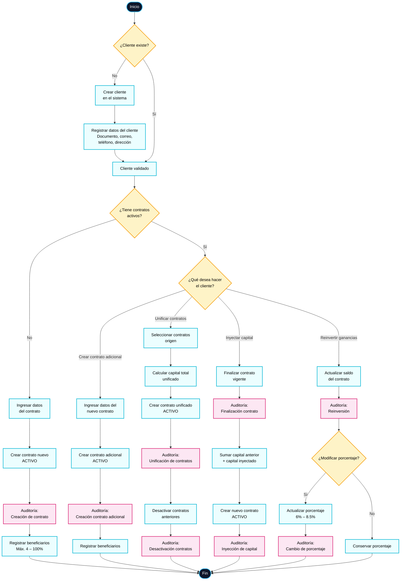

```mermaid
flowchart TD

    %% ========= INICIO =========
    A([Inicio])

    %% ========= VALIDAR CLIENTE =========
    A --> B{¿Cliente existe?}

    B -- No --> C[Crear cliente<br/>en el sistema]
    C --> D[Registrar datos del cliente<br/>Documento, correo,<br/>teléfono, dirección]
    D --> E[Cliente validado]

    B -- Sí --> E

    %% ========= VALIDAR CONTRATOS =========
    E --> F{¿Tiene contratos<br/>activos?}

    %% ========= ESCENARIO 1: SIN CONTRATOS =========
    F -- No --> G[Ingresar datos<br/>del contrato]
    G --> H[Crear contrato nuevo<br/>ACTIVO]
    H --> H1[Auditoría:<br/>Creación de contrato]
    H1 --> I[Registrar beneficiarios<br/>Máx. 4 – 100%]
    I --> Z([Fin])

    %% ========= ESCENARIO 2: CON CONTRATOS =========
    F -- Sí --> J{¿Qué desea hacer<br/>el cliente?}

    %% ====== OPCIÓN: CREAR CONTRATO ADICIONAL ======
    J -- Crear contrato adicional --> K[Ingresar datos del<br/>nuevo contrato]
    K --> L[Crear contrato adicional<br/>ACTIVO]
    L --> L1[Auditoría:<br/>Creación contrato adicional]
    L1 --> M[Registrar beneficiarios]
    M --> Z

    %% ====== OPCIÓN: UNIFICAR CONTRATOS ======
    J -- Unificar contratos --> N[Seleccionar contratos<br/>origen]
    N --> O[Calcular capital total<br/>unificado]
    O --> P[Crear contrato unificado<br/>ACTIVO]
    P --> P1[Auditoría:<br/>Unificación de contratos]
    P1 --> Q[Desactivar contratos<br/>anteriores]
    Q --> Q1[Auditoría:<br/>Desactivación contratos]
    Q1 --> Z

    %% ====== OPCIÓN: INYECTAR CAPITAL ======
    J -- Inyectar capital --> S[Finalizar contrato<br/>vigente]
    S --> S1[Auditoría:<br/>Finalización contrato]
    S1 --> T[Sumar capital anterior<br/>+ capital inyectado]
    T --> U[Crear nuevo contrato<br/>ACTIVO]
    U --> U1[Auditoría:<br/>Inyección de capital]
    U1 --> Z

    %% ====== OPCIÓN: REINVERTIR GANANCIAS ======
    J -- Reinvertir ganancias --> W[Actualizar saldo<br/>del contrato]
    W --> W1[Auditoría:<br/>Reinversión]
    W1 --> X{¿Modificar porcentaje?}
    X -- Sí --> Y[Actualizar porcentaje<br/>6% – 8.5%]
    Y --> Y1[Auditoría:<br/>Cambio de porcentaje]
    Y1 --> Z
    X -- No --> AA[Conservar porcentaje]
    AA --> Z

    %% ========= ESTILOS =========
    classDef inicioFin fill:#0f172a,color:#ffffff,stroke:#38bdf8,stroke-width:2px
    classDef decision fill:#fef3c7,color:#000000,stroke:#f59e0b,stroke-width:2px
    classDef proceso fill:#ecfeff,color:#000000,stroke:#06b6d4,stroke-width:2px
    classDef auditoria fill:#fce7f3,color:#000000,stroke:#db2777,stroke-width:2px

    class A,Z inicioFin
    class B,F,J,X decision
    class C,D,E,G,H,I,K,L,M,N,O,P,Q,S,T,U,W,Y,AA proceso
    class H1,L1,P1,Q1,S1,U1,W1,Y1 auditoria
```
