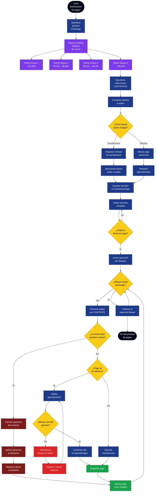

```mermaid
flowchart TD
    %% ========================
    %% INICIO PLANIFICACIÓN
    %% ========================
    A([Inicio<br/>planificación<br/>de pagos])

    A --> B[Identificar<br/>próximo<br/>CicloPago]
    B --> C[Gerencia define<br/>bloques<br/>de monto]

    C --> C1[Definir bloque 1<br/>≤ $1,500]
    C --> C2[Definir bloque 2<br/>$1,501 – $3,000]
    C --> C3[Definir bloque 3<br/>$3,001 – $5,000]
    C --> C4[Definir bloque 4<br/>> $5,000]

    %% ========================
    %% PREPARACIÓN
    %% ========================
    C4 --> D[Ejecutivos<br/>seleccionan<br/>CONTRATOS]
    D --> E[Contactar clientes<br/>si aplica]

    E --> F{¿Cómo desea<br/>recibir el pago?}

    F -- Transferencia --> G[Registrar método<br/>de transferencia]
    G --> G1[Seleccionar banco<br/>wallet o medio]

    F -- Efectivo --> H[Marcar pago<br/>presencial]
    H --> H1[Requiere<br/>agendamiento]

    %% ========================
    %% VALIDACIÓN
    %% ========================
    G1 --> I[Guardar decisión<br/>en DecisionesPago]
    H1 --> I

    I --> J[Validar decisión<br/>completa]
    J --> K{¿Llegó la<br/>fecha de pago?}

    %% ========================
    %% EJECUCIÓN
    %% ========================
    K -- No --> J
    K -- Sí --> L[Iniciar ejecución<br/>por bloques]

    L --> M{¿Bloque actual<br/>terminado?}

    %% ========================
    %% BLOQUE ACTUAL
    %% ========================
    M -- No --> N[Procesar pagos<br/>por CONTRATO]

    %% ===== VALIDAR PRÉSTAMO DEL CONTRATO =====
    N --> P0{¿Contrato tiene<br/>préstamo activo?}

    %% ===== CONTRATO CON PRÉSTAMO =====
    P0 -- Sí --> P1[Calcular ganancia<br/>del contrato]
    P1 --> P2[Aplicar ganancia<br/>al préstamo]
    P2 --> P3[Registrar abono<br/>a préstamo]
    P3 --> V[Marcar resultado<br/>como Aplicado<br/>a deuda]

    %% ===== CONTRATO SIN PRÉSTAMO =====
    P0 -- No --> O{¿Pago es<br/>en efectivo?}

    O -- Sí --> P[Validar<br/>agendamiento]
    P --> Q{¿Bloque permite<br/>agendar?}

    Q -- No --> R[Advertencia<br/>bloque no activo]
    R --> R1[Registrar intento<br/>especial]
    R1 --> P

    Q -- Sí --> S[Confirmar cita<br/>en AgendaPagos]

    O -- No --> T[Ejecutar<br/>transferencia]

    S --> U[Registrar pago]
    T --> U

    U --> V[Marcar pago<br/>como Pagado]

    %% ========================
    %% CONTROL
    %% ========================
    V --> M
    M -- Sí --> W[Avanzar al<br/>siguiente bloque]
    W --> M

    %% ========================
    %% FIN
    %% ========================
    W --> Z([Fin del proceso<br/>de pagos])

    %% ========================
    %% ESTILOS
    %% ========================
    classDef inicioFin fill:#020617,color:#ffffff,stroke:#0f172a,stroke-width:2px
    classDef proceso fill:#1e3a8a,color:#ffffff,stroke:#1e40af
    classDef decision fill:#facc15,color:#000000,stroke:#ca8a04
    classDef gerencia fill:#7c3aed,color:#ffffff,stroke:#6d28d9
    classDef advertencia fill:#dc2626,color:#ffffff,stroke:#991b1b
    classDef pago fill:#16a34a,color:#ffffff,stroke:#166534
    classDef prestamo fill:#7f1d1d,color:#ffffff,stroke:#450a0a

    class A,Z inicioFin
    class B,D,E,G,G1,H,H1,I,J,L,N,P,P1,P2,P3,S,T,W proceso
    class C,C1,C2,C3,C4 gerencia
    class F,K,M,O,Q,P0 decision
    class R,R1 advertencia
    class U,V pago
    class P1,P2,P3 prestamo
```