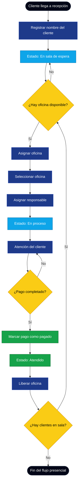

```mermaid
flowchart TD
    %% ========================
    %% LLEGADA DEL CLIENTE
    %% ========================
    A([Cliente llega a recepción])

    A --> B[Registrar nombre del cliente]
    B --> C[Estado: En sala de espera]

    %% ========================
    %% ASIGNACIÓN DE OFICINA
    %% ========================
    C --> D{¿Hay oficina disponible?}

    D -- No --> C
    D -- Sí --> E[Asignar oficina]

    E --> E1[Seleccionar oficina]
    E1 --> E2[Asignar responsable]

    %% ========================
    %% ATENCIÓN
    %% ========================
    E2 --> F[Estado: En proceso]
    F --> G[Atención del cliente]

    %% ========================
    %% CIERRE
    %% ========================
    G --> H{¿Pago completado?}

    H -- No --> G
    H -- Sí --> I[Marcar pago como pagado]

    I --> J[Estado: Atendido]
    J --> K[Liberar oficina]

    %% ========================
    %% RETORNO
    %% ========================
    K --> L{¿Hay clientes en sala?}

    L -- Sí --> D
    L -- No --> Z([Fin del flujo presencial])

    %% ========================
    %% ESTILOS
    %% ========================
    classDef inicioFin fill:#020617,color:#ffffff,stroke:#0f172a,stroke-width:2px
    classDef proceso fill:#1e3a8a,color:#ffffff,stroke:#1e40af
    classDef decision fill:#facc15,color:#000000,stroke:#ca8a04
    classDef estado fill:#0ea5e9,color:#ffffff,stroke:#0369a1
    classDef cierre fill:#16a34a,color:#ffffff,stroke:#166534

    class A,Z inicioFin
    class B,E,E1,E2,G,I,K proceso
    class C,F,J estado
    class D,H,L decision
    class I,J cierre
``` 